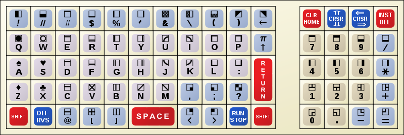
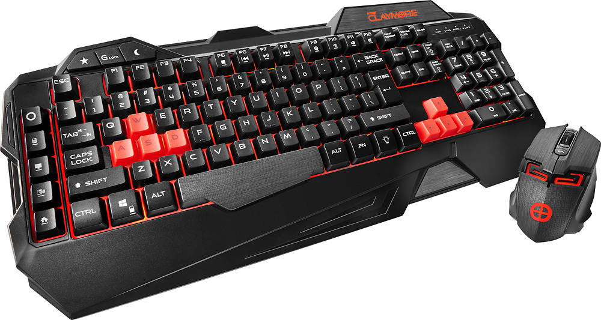

:css: css/slides.css
:skip-help: true

.. title: Keyboards!

----

Consider the Keyboard
=====================

.. image:: images/hansen_writing_ball.jpg
    :width: 50%

.. note::

    Your fingers and your keyboard is what sits between your brain and your
    code.

    Your Keyboard needs to be adapted to you!

    And it needs adaptation to you not only so you can type on it quickly and
    accurately, but also so you can continue to use it all day long without
    hurting yourself!

----

.. note::

    So how did you select your keyboard? Are you using the keyboard that came
    with your computer?

----

.. note::

    Or did you choose it because it has sharp angles or a Z in the name?

    Is it really adapted to you?

----

Home row touch typing
=====================

.. image:: images/keyboarding.png

.. note::

    How many use touch typing here?

    Look at this picture.
    Where is this guys arms?
    Does he hold it straight out?
    Are his arms attached to the centre of his chest?

----

Home row touch typing
=====================

.. image:: images/wrist_bad2_sm.jpg

.. note::

    Rather, you end up sitting like this. And that's bad for your wrists.

----

Home row touch typing
=====================

.. image:: images/Truly_Ergonomic_Mechanical_Keyboard-207.jpg

.. note::

    If you are a touch typist, you might want to think about something like this instead.

----

Whoah!
======

.. image:: images/advantageusb.jpg

.. note::

    You may if you go to many Python sprints see people who actually will
    drag keyboards like this around the world. They tend to be quite
    fanatical about them. They are probably awesome.

    But I'm not a touch typist, for me keyboards that are split in half is
    just annoying.

----

Numerical Keypad
================

.. note::

    Do you use the numerical keyboard?
    A lot of people don't use it very often.
    It's there because IBM who created the standard keyboard created it for it's
    main frame terminals, and those using it typed in a lot of numbers.

----

No Numerical Keypad!
====================

.. image:: images/15007-ergonomic_keyboard_comparison.jpg

.. note::

    In fact, it forces you to hold your arm to far to the right when mousing.
    And this can lead to shoulder pain. Especially if you have narrow
    shoulders, like most women.

    Who knew your keyboard is sexist?

    But you probably don't use the numerical keyboard that much. And then
    it's just in the way. But go to the shop and the keyboards without a
    numerical keypad are often minikeyboards, with tiny keys. You don't want
    that, believe me!

----

Tenkeyless
==========

.. image:: images/filco_tenkeyless_brown_uk_large.jpg

.. note::

    The common name for a full size keyboard that does not have a numerical
    keypad is "tenkeyless". If you don't use the numerical keyboard a lot,
    that's what you want.

----

Linear, Tactile, Clicky
=======================

.. image:: images/Force_graph--tactile--Cherry_ML.svg
    :width: 100%

.. note::

    The terms Linear, Tactile and Clicky shows up a lot when it comes to key
    technology, and it's the three types of feedback you get about if you
    have pressed a key or not. This graph illustrates this.

    What you see is a graph over how much pressure you need to move the key
    over how far the key has been depressed. You can see that the pressure
    required at one point. Of course, what actually happens here is not that
    you press less on the key, no, what instead happens is that they key will
    suddenly move further.

    When you have this behaviour, the key is called "tactile", because you
    get tactile feedback that they key was pressed. This is good, it helps you
    know what you types without looking at the screen, and it also helps you
    know which key you pressed if you happened to touch several keys at once.

----

Exercise!
=========

.. image:: images/carpal_tunnel_exercise.jpg
    :width: 100%

----

Deskthority
===========

http://deskthority.net/wiki/

.. note::

    So, what keyboard should YOU have?

    Well I can only recommend you to read and read and read on Deskthority's big wiki,
    which has crazy amounts of information on keyboards and keyboard switches.
