:css: css/slides.css
:skip-help: true

.. title: Keyboards!

----

Your keyboard
=============

Lennart Regebro

PyCon PL 2015

.. note::

    I realized last year here at PyCon PL that a lot of people didn't actually
    actively choose their keyboard but just used whatever happened to come
    with their PC's or lie around.

    But the keyboard is the Analog to Digital interface that you use the most.
    It's what makes your physical movements into code. It needs to be adapted
    to you!

----

Scare tactics!
==============

.. note::

    And it needs adaptation to you not only so you can type on it quickly and
    accurately, but also so you can continue to use it all day long without
    hurting yourself!

    Most people never get any problems, so don't worry, but you can get problems,
    and the most common place is in the carpal tunnel.

----

Exercise!
=========

.. image:: images/carpal_tunnel_exercise.jpg
    :width: 100%

----

A history of the keyboard
=========================

.. image:: images/hansen_writing_ball.jpg
    :width: 50%

.. note::

    Now, before we look at what keyboards people might want to use, I thought
    it could be interesting to look at the history of the keyboard, to understand
    why keyboards look like they do!

    The keyboard was created for mechanical typewriters. And this is the
    first commercially available type writer, the Hansen Typing Ball.
    A Danish invention, and as you can see, the inventor bothered more about
    how to get text on the paper than usability.

    But it was reasonably fast to use, and the keys arranged so that the most
    common letters were available for the fastest and strongest fingers.

----

.. image:: images/sholes_prototype_1.jpg
    :width: 100%

.. note::

    Meanwhile in US, some people were working on a type writer by their own.
    Here you see what is left of their first prototype. Yes, they took their
    keyboard inspiration from another already existing keyboard: A piano.

----

.. image:: images/sholes_prototype_2.jpg
    :width: 70%

.. note::

    They quickly ditched the piano keys, and in this prototype you can see
    how the machine worked. Pressing a key simply pull a wire, that pulls in
    a small hammer that will hit the paper against a wooden roller and
    impress a letter on the paper. Because these hammers are arranged in a
    circle, if you press two keys at the same time, they can become
    entangled.

----

.. image:: images/sholes_prototype_final.jpg
    :width: 100%

.. note::

    To make it harder for the keys to get stuck, keys that are often used
    together in the English language was placed opposite each other in the
    ring of hammers. The end result was this rather weird layout, which
    contrary to myth is not made to slow typing down, but to speed it up by
    eliminating jams!

    Although several people was involved in the development of this type
    writer, it's named after only two of them, and generally called a
    Sholes and Glidden or a Remington typewriter, after the company who
    licensed the patent and manufactured them.

----

.. image:: images/remington_no1.jpg
    :width: 70%

.. note::

    At least remington realized that having a dash in the middle of all the
    letters was strange, and here you can also see another invention; the
    space bar.

    The M is not in the place it is today but other than that this layout
    remained the same for a long time. Using a capital I for the number
    one and a capital O for zero was common on cheaper type writers well
    up to the 50's and 60's.

    This layout was patented, so other keyboard manufacturers had to
    use their own layouts, as well as their own mechanisms. But the
    Remington was so popular that the QWERTY layout simply became
    standard.

----

.. image:: images/underwood-no1.jpg
    :width: 70%

.. note::

    The shift-key is invented in 1878, and front-striking machines come in
    the 1893 and in 1896 the Underwood No 1, pictured here was produced.
    It has, as you can see, a QWERTY keyboard, a shift-key, front-striking,
    so you can see what you type, and a small bell that goes "ding" when you
    get close to the end of the line.

    Typewriter design basically copied the Underwood up to 1961, when IBM
    introduced the IBM Selectric.

----

.. image:: images/ibm_selectric.jpg
    :width: 70%

.. note::

    It replaced the basket of hammers with a ball, and and finally solved the
    problem of keys tangling each other.

    But by then, there was another business machine that IBM was starting to
    make money from.

----

.. image:: images/IBM2741.jpg
    :width: 70%

.. note::

    Computers needed input and output, and in the 60's this was punch cards
    and printers. But that wasn't very practical, and soon this was replaced
    with terminals. This is an IBM 2741 from 1965. You are forgiven if you
    think it looks like a Selectric.

----

.. image:: images/IBM_3277_Display.jpg
    :width: 70%

.. note::

    Of course, paper terminals were loud and unpractical, so this was
    replaced with screens.

    This is the IBM 3270 terminal from 1972. The chunky keyboard is more or
    less a selectric keyboard, but with a set of arrow keys and twelve
    function keys to the right.

    No, that is NOT a numerical key pad, it's 12 function keys. If you look
    at your keyboard, how many function keys does it have? Yup. This terminal
    is the reason for that.

----

.. image:: images/5251-1.jpg
    :width: 100%

.. note::

    During the 70's terminals was used more and more by office workers. One
    of the things done a lot in these offices was data entry. Typing in loads
    and loads of numbers.

    For it's System/34 mini computer IBM designed a terminal directly designed
    for that environment, the 5250. And here you see a numeric keyboard!

    It lost the function key, but later versions compensated by having 24.

----

.. image:: images/IBM_Model_M.png
    :width: 100%

.. note::

    And if you wonder why this history contains only IBM keyboards, it's
    because of course the computers we all use today are descendants of the
    IBM PC. And although the original IBM PC keyboard had a very different
    layout than todays PC keyboards, with for example ten function keys to
    the left of the main keyboard, by 1984 IBM designed the Model M keyboard
    shown here.

    And some of the design features comes directly from IBM's desire to unify
    it's systems and also from the realization that people would want to use
    the PC's as terminal emulators to connect to the economy system on the
    mainframes, while still running Lotus 1-2-3 and Wordperfect on the PC.

    So it gained buttons like "Scroll Lock" and "Sys Request", and gained
    two extra function keys. The only changes to this layout since has been
    Microsoft adding command-keys, inspired by Apple, and various manufacturers
    adding multimedia keys.

----

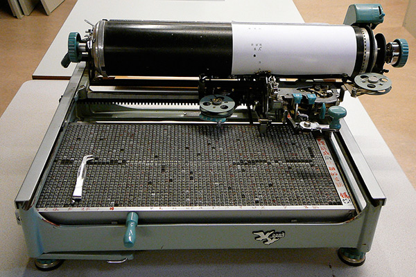

.. note::

    Of course, keyboards for languages that use non-Latin characters all look
    completely different, and as in this Chinese example, the whole
    typewriter looks different. This in fact has no keys, just a large set if
    loose types, and you move the whole machinery to the right type, which
    then gets picked up and hammered onto the paper.

    But for the rest of the talk I'll talk about keyboards for alphabets. I
    really have no clue how relevant this is for other character systems.

----

History lesson concluded
========================

.. note::

    So that's how the keyboard happened, and why it looks like it does:
    Straight rows of keys with a slight offset, with a QWERTY layout and
    numerical keyboard and a bunch of function keys. But the reasons are now
    mostly outdated, including the keys for mainframe emulation, as even
    those who still use these old systems usually now have GUI interfaces
    instead of terminal emulation.

----

Keys in a row
=============

.. note::

    There are basically two modes of typing:

    * The first school of typing is called home row touch typing

    * There is no second school

----

Home row touch typing
=====================

.. image:: images/keyboarding.png

.. note::

    How many use touch typing here?

    Look at this picture.
    Where is this guys arms?
    Does he hold it straight out?
    Are his arms attached to the centre of his chest?

----

Home row touch typing
=====================

.. image:: images/wrist_bad2_sm.jpg

.. note::

    Rather, you end up sitting like this. And that's bad for your wrists.

----

Home row touch typing
=====================

.. image:: images/Truly_Ergonomic_Mechanical_Keyboard-207.jpg

.. note::

    If you are a touch typist, you might want to think about something like this instead.

----

Whoah!
======

.. image:: images/advantageusb.jpg

.. note::

    You may if you go to many Python sprints see people who actually will drag keyboards like this around the world.
    They tend to be quite fanatical about them.
    They are probably awesome.

----

No school typing
================

.. note::

    But for the rest of us, keyboards that are split in half are annoying.

----

To QWERTY or not to QWERTY?
===========================

.. note::

    Although most countries that use latin alphabets use QWERTY, Turkey being
    a notable exception, each country for various reasons tend to have it's
    own keyboard. It's not each language, nono, it's typically each
    *country*, with a few exceptions, like a lot of Latin America having the
    same Spanish keyboard, although for some reason is different than the one
    used in Spain.

    And there is many countries that have English as an official language, but
    only four different keyboard layout regions.

----

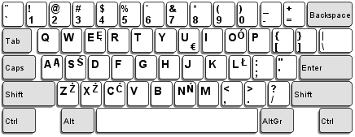

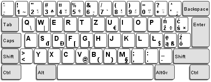

.. note::

    Some countries have many official languages and many different keyboards,
    others, like Canada, make one keyboard to support several languages.

    And of course, some countries use different keyboard layouts for the same
    language, most notably Poland, who has two layouts, one called
    "Programmers layout" and the other called "That weird layout Windows
    switches to by itself randomly".

----

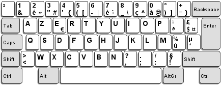

.. note::

    And when I say most countries use QWERTY, what I mean is that they use
    variations of QWERTY. Even change the positions of A to Z. The French for
    example use AZERTY, which has a few keys switched, and keeps the M in the
    old position. More problematic, it has the numerical keys and the
    punctuation switched around so you have to press shift to enter numbers.
    Very annoying.

    The origin of the AZERTY layout is lost in history, my completely
    unfounded guess is that it's actually a way to circumvent the QWERTY
    patent, but I don't actually have any evidence of that.

    The German QWERTZ layout puts T and Z close to each other, despite TZ
    being a common combination of letters in German. That change therefore
    actually made German keyboards at least in theory MORE susceptible to
    jamming!

----

Pump up the Jam
===============

.. note::

    But now keyboards are electronic, and only jam after you spill coca cola
    in them, so the QWERTY layout is outdated.

    Many attempts have been made to make keyboard layouts that are designed
    to improve typing speed. The most well known of these are the Dvorak
    layouts.

----

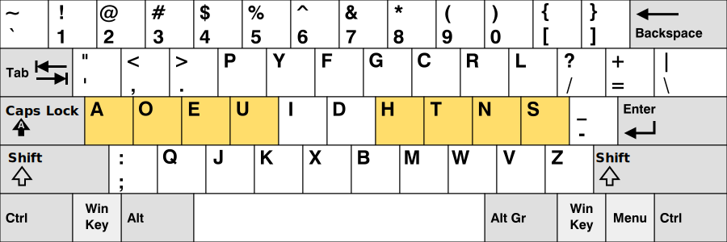

.. note::

    The English Dvorak layout keeps all vowels on the left hand, and has the
    most common consonants on the right hand. Dvorak also used some statistical
    analysis to minimize the cases where one finger needed to jump from the top
    row to the bottom row or vice versa, as in the word "minumum" on a QWERTY
    keyboard.

    This all speeds up typing and increases accuracy, at least in theory. It
    has turned out to be hard to prove that this is actually the case.

----

Localized Dvoraks
=================

.. note::

    Now if you localize a Dvorak layout, you should really do statistical
    analysis on each language and rearrange letters according to that. But
    for some reason, nobody seems to do this. Polish uses Z a lot more than
    English does for example, but Dvorak puts it on the bottom row for the
    right hand pinky finger. It's a worse position than even single V, which
    Polish doesn't even have. Despite this, the Polish layouts for Dvorak
    keeps the basic Dvorak layout.

    And many countries also have multiple Dvorak layouts. Poland seems to
    have three layouts. They all suffer from the same problems with Ł and
    Ź, etc, you need to use alt-gr + the right pinky.

    There are two Swedish layouts, one keeps compatibility with Swedish
    hardware, you can just move around the keycaps on a standard Swedish
    keyboard. The other keeps the layout as close as possible to American
    Dvorak, even for punctuation. This makes it better for programming.

----

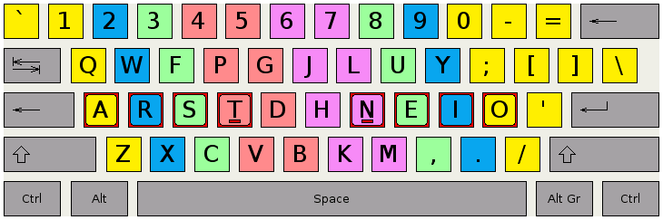

.. note::

    Colemak keeps punctuation in the same place as the american QWERTY, but
    moves around the letters to speed things up, but only if necessary.
    As a result it's easier to learn than Dvorak, and claims to be better,
    as you don't have to use your little fingers as much.

    It also rmakes Caps Lock into a second backspace, because I mean,
    WTF, Caps Lock? Who uses that? It's just annoying.

----

.. image:: images/workman.png
    :width: 100%

.. note::

    The Workman layout realizes that the index finger rather moves down
    to the bottom row than up to the top row. You can all check that for
    yourself, how neither Dvorak nor Coleman realized this is rather
    funny.

    All of these thing the right hand is more capable than the left,
    which is a problem for left handed people. And for everyone else as well,
    since we now often have the right hand on the mouse.

    Worst of all, both Dvorak and Workman changes where X, C and V are
    makeing copying and pasting less smooth, although Workman only
    changes it a little bit.

----

Numerical Keypad
================

.. note::

    Do you use the numerical keyboard?
    A lot of people don't use it very often.
    It's there because IBM who created the standard keyboard created it for it's
    main frame terminals, and those using it typed in a lot of numbers.

----

No Numerical Keypad!
====================

.. image:: images/15007-ergonomic_keyboard_comparison.jpg

.. note::

    In fact, it forces you to hold your arm to far to the right when mousing.
    And this can lead to shoulder pain.

    But you probably don't use it that much. And then it's just in the way.
    But go to the shop and the keyboards without a numerical keypad are
    often minikeyboards, with tiny keys. You don't want that, believe me!

----

Tenkeyless
==========

.. image:: images/filco_tenkeyless_brown_uk_large.jpg

.. note::

    The common name for a full size keyboard that does not have a numerical
    keypad is "tenkeyless". If you don't use the numerical keyboard a lot,
    that's what you want.

----

ISO or ANSI?
============

.. image:: images/616px-ISO_layout_basic.svg.png

.. image:: images/616px-ANSI_layout_basic.svg.png

.. note::

    Also: Buyers beware! There are two mayor physical keyboard layouts, ISO, above, ANSI, below.
    Not only is using the layout you are not used to very annoying because you end up pressing a key instead of enter,
    but ANSI is missing a key!

    That key happens to be the key where larger and smaller are on the Swedish keyboard.
    Not having those makes web development hard.

    Polish has standard layouts for both, so you can use whatever, the ANSI
    layout is the most popular here. You on the other hand have two layouts,
    one official and one that everyone uses.

----

Let's switch!
=============

.. note::

    Now we come to the really fun bit! The actual key switch mechanics! And
    before we talk about the mechanics, we are going to talk about why
    different mechanics matter.

----

Tactile, Linear, Clicky
=======================

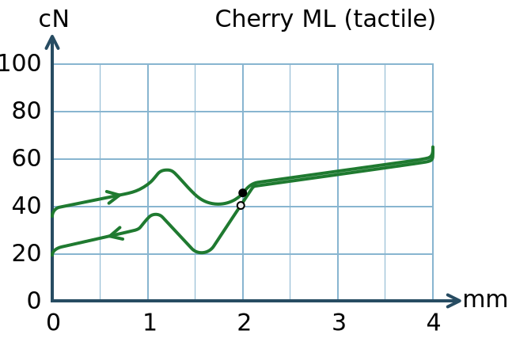

.. note::

    The terms Linear, Tactile and Clicky shows up a lot when it comes to key
    technology, and it's the three types of feedback you get about if you
    have pressed a key or not. This graph illustrates this.

    What you see is a graph over how much pressure you need to move the key
    over how far the key has been depressed. You can see that the pressure
    required at one point. Of course, what actually happens here is not that
    you press less on the key, no, what instead happens is that they key will
    suddenly move further.

    When you have this behaviour, the key is called "tactile", because you
    get tactile feedback that they key was pressed. This is good, it helps you
    know what you types without looking at the screen, and it also helps you
    know which key you pressed if you happened to touch several keys at once.

----

.. image:: images/keyboard_buckling_spring.gif
    :width: 100%

.. note::

    A clicky key is one that not only is tactile, but also emits an audible
    noise when activated. Famous keyboards that are clicky are the IBM
    keyboards, that use a spring inside to create the tactile feedback. The
    spring would not only provide the feel, but it would also hit the plastic
    with a loud click.

    These keyboards are very loud, but you have to remember they were
    designed for offices that was used to typewriters, so nobody thought it
    was a problem.

----

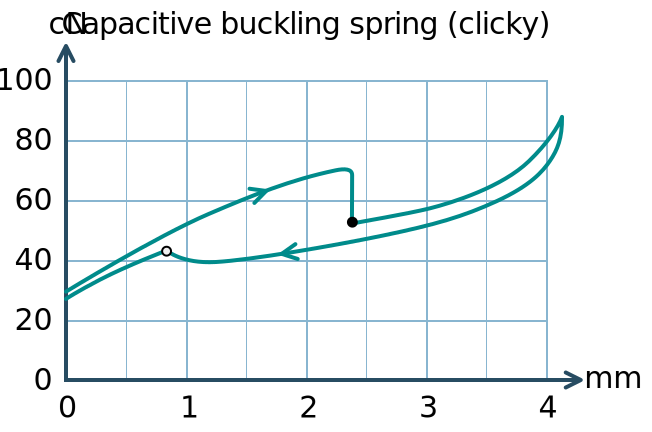

.. note::

    As you can see, the force needed drops very quickly with these keyboards,
    so the tacticle feedback is very strong even though there is no real
    "bump". The result is that some people strongly prefer these keyboards
    to any other keyboards. You have to type quite hard on them though.

----

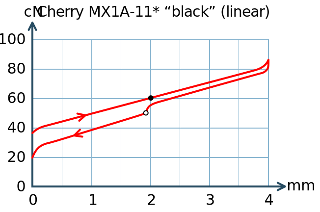

.. note::

    Here is a linear force graph, as you can see, you don't have any feedback of when they
    key is pressed. This is not necessarily bad, it depends on how big the key travel is.
    The travel is how much the key can move. And here we come into the actual switch mechanics.

----

Switch mechanics
================

.. note::

    There are several different types of mechanics, but today there are basically
    only two used, they are called "Rubber dome" and "Gold crosspoint". And as you can
    hear from just the name, the Gold crosspoint is the best!

    No, just joking, it's not that easy.

----

Rubber dome
===========

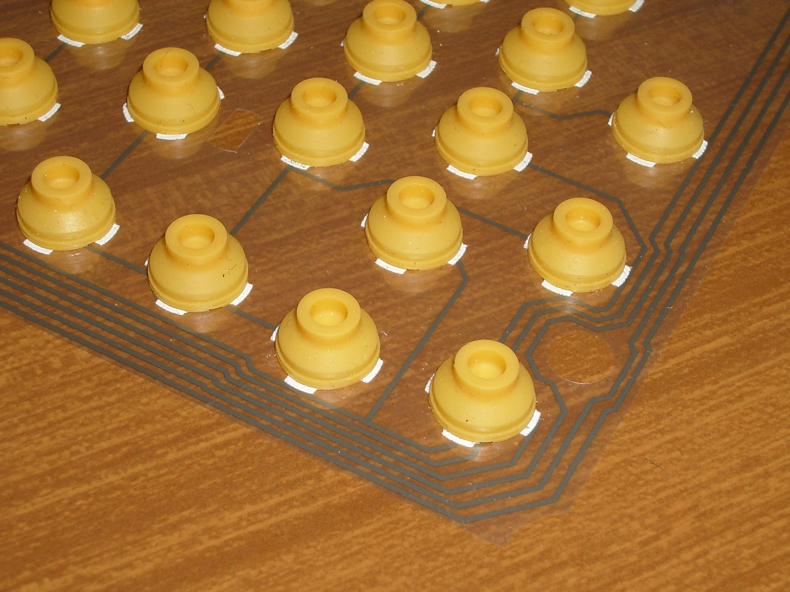

.. note::

    A rubber dome is indeed just a dome of rubber that the key will press down on. Today
    rubber dome keyboards are generally glued onto these transparent plastic membrane sheets.
    This is cheap to manufacture, and the rubber domes can be easily manufactured to provide
    different amount of required pressure, and they tend to be slightly tactile.

    But they tend to be "spongy" to the feel and the keys can feel rather wobbly and unstable.
    To fix that problem, a key type called scissor switch was invented.

----

Scissor switch
==============

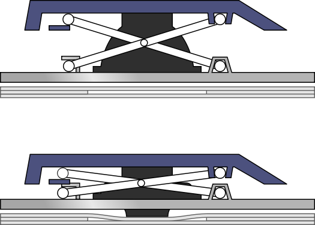

.. note::

    A scissor switch has these two little metal arms in a scissor
    configuration on both site of the key. This helps stabilise the key.
    Scissor switches have a great benefit, they can be made very compact
    with very little travel. For that reason they are used in almost every
    modern laptop.

    They often have tactile feedback, but generally very little, but this is
    not a problem since they also have so short travel. That means that you
    know that you have pressed a key, because it stopped moving. Since the
    rubber is taking the force, they are also generally quite silent, and
    they usually don't need a lot of force to be pressed. This means a lot
    of people prefer this type of key. I used an Apple keyboard for years,
    they are very good.

----

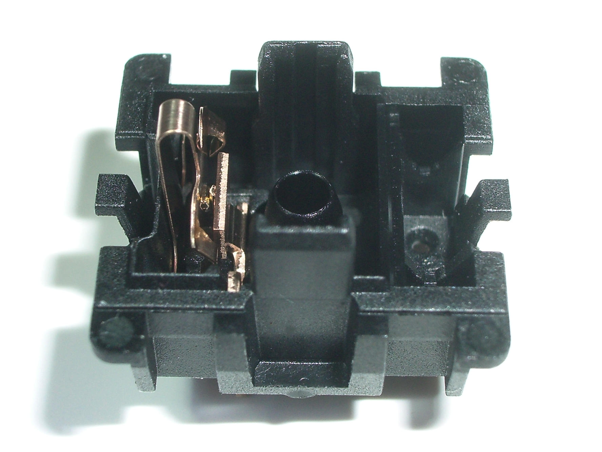

.. note::

    The gold crosspoint contacts looks like this, it's two gold plated tubes
    with cutouts that meet at a crosspoint. This is to ensure good contact.
    This is what you find in high end keyboards. Their main benefit is that
    there is no rubber dome, so they don't feel spongy, and since the contact
    is mechanical and doesn't have the thin sheets of plastic that most
    rubber dome keyboards have today, keyboards with these switches can
    withstand a lot of abuse. I've poured coffee in keyboards like this, and
    when the coffee dried and keys started to stick, I simply rinsed the
    keyboard in lukewarm water and then lay it to dry for a few days. YMMV,
    don't try that at home, it's a last resort etc.

    But if you try that with a keyboard that has plastic membranes, chances
    are it will never work again.

----

Cherry MX
=========

.. image:: images/Mx_brown_illustration.gif
    :width: 50%

.. note::

    The most well known of these types are switches are called Cherry MX.
    They come in various colors that have various characteristics, and there
    are both linear, tactile and clicky variations.

    I use Cherry MX brown, which is lightly tactile but not clicky. However,
    they still make a clicky noise when you hit the bottom of the key travel.
    And, as most switches of this type, they have quite a long travel. This
    is both fixable!

----

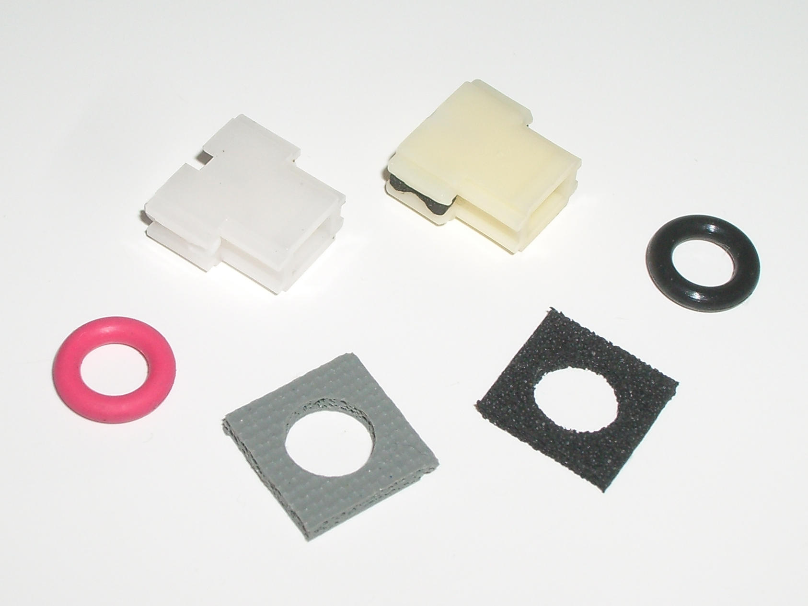

.. note::

    Fixing the noise is called "Damping", and can be done in various ways. It can be
    built into thge switch, or you can put these plastic dampeners on, adding the quare
    "landing pads", or putting a little rubber o-ring on the keycap.

----

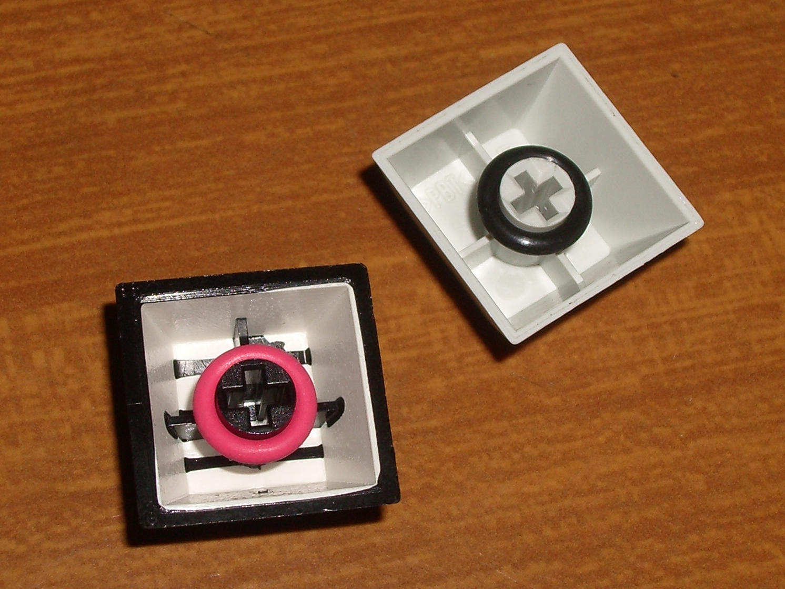

.. note::

    My keyboard has o-rings fitted. Cheap and easy, although fiddly if you do it yourself.

----

Whacky keyboards!
=================

.. note::

    But that's not the end of it! There are more outrageous keyboard designes out there
    than the Kinesis Advantage. Oh, yes. But they tend to be more specialized.

----

Chorded keyboard
================

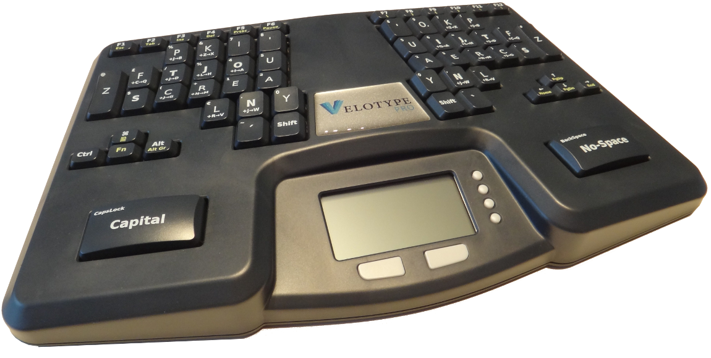

.. note::

    This for example is a chorded keyboard. Here it's not one key that is
    connected to one character, instead it's combinations of keys, in some
    cases you don't even get characters, you get syllables.

    This particular keyboard is called a velotype and is designed for real
    time subtitling. Yes, it's so fast to use once you learned it that you
    can type faster than people speak. I'm going to guess it's not very good
    for programming.

----

Touchless keyboards
===================

.. image:: images/touchless-keyboard.jpg
    :width: 100%

.. note::

    The word "touchless" is a misnomer, since you usually have to touch them.
    However, they require no force to press a key, and are good if you get
    carpal tunnel syndrome or artritis, or other pains.

    This particular keyboard is called the LightIO, and is based on your
    finger blocking light to detect keystrokes.

    Of course, with touchless keyboards you really have to tactile feedback at
    all, and that's the biggest problem with them.

----

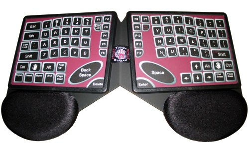

.. note::

    I used to have one of these keyboard, well, I still do, but it's broken
    now. It's basically two multitouch pads, and it was awesome. It had
    gesture capabilities, and the right hand touchpad controled the mouse and
    the left hand controlled the cursor.

    But as a keyboard it was pretty useless because you had no way of knowing
    if you had pressed a key or not. So close to amazing, yet so far. I had
    an idea of how to fix that, but by the time I had that idea Apple had
    bought that company and they stopped making keyboards and started making
    iPhones instead.

----

Deskthority
===========

http://deskthority.net/wiki/

.. note::

    So, what keyboard should YOU have?

    Well I can only recommend you to read and read and read on Deskthority's big wiki,
    which has crazy amounts of information on keyboards and keyboard switches.

----

Tenkeyless Cherry MX Brown with dampener rings
==============================================

.. image:: images/Mx_brown_illustration.gif

.. note::

    After much research I bought a tenkeyless keyboard with Swedish QWERTY
    layout that uses Cherry MX Brown switches and has dampener rings. I'm
    very happy with it.

----

Exercise!
=========

.. image:: images/carpal_tunnel_exercise.jpg
    :width: 100%

----

That's all folks!
=================

* http://deskthority.net/wiki/

* http://www.kinesis-ergo.com/

* http://www.keyboardco.com/
