:css: css/slides.css

----

Your keyboard
=============

PyCon PL 2015

.. note::

    I realized last year here at PyCon PL that a lot of people didn't actually
    actively choose their keyboard but just used whatever happened to come
    with their PC's or lie around.

    But the keyboard is the Analog to Digital interface that you use the most.
    It's what makes your physical movements into code. It needs to be adapted
    to you!

----

Scare tactics!
==============

.. note::

    And it needs adaptation to you not only so you can type on it quickly and
    accurately, but also so you can continue to use it all day long without
    hurting yourself!

    Most people never get any problems, so don't worry, but you can get problems,
    and the most common place is in the carpal tunnel.

----

Exercise!
=========

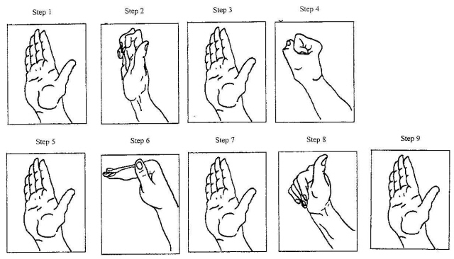

----

A history of the keyboard
=========================

.. image:: images/hansen_writing_ball.jpg
    :width: 50%

.. note::

    Now, before we look at what keyboards people might want to use, I thought
    it could be interesting to look at the history of the keyboard, to understand
    why keyboards look like they do!

    The keyboard was created for mechanical typewriters. And this is the
    first commercially available type writer, the Hansen Typing Ball.
    A Danish invention, and as you can see, the inventor bothered more about
    how to get text on the paper than usability.

    But it was reasonably fast to use, and the keys arranged so that the most
    common letters were available for the fastest and strongest fingers.

----

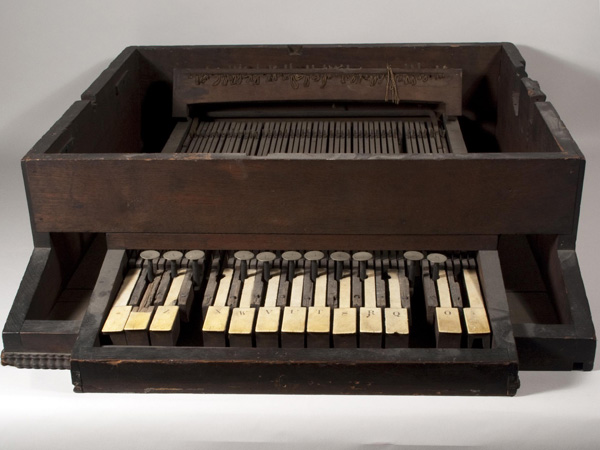

.. note::

    In US, three guys were working on a type writer by their own. Here you
    see what is left of their first prototype. Yes, they took their keyboard
    inspiration from another already existing keyboard: A piano.

----

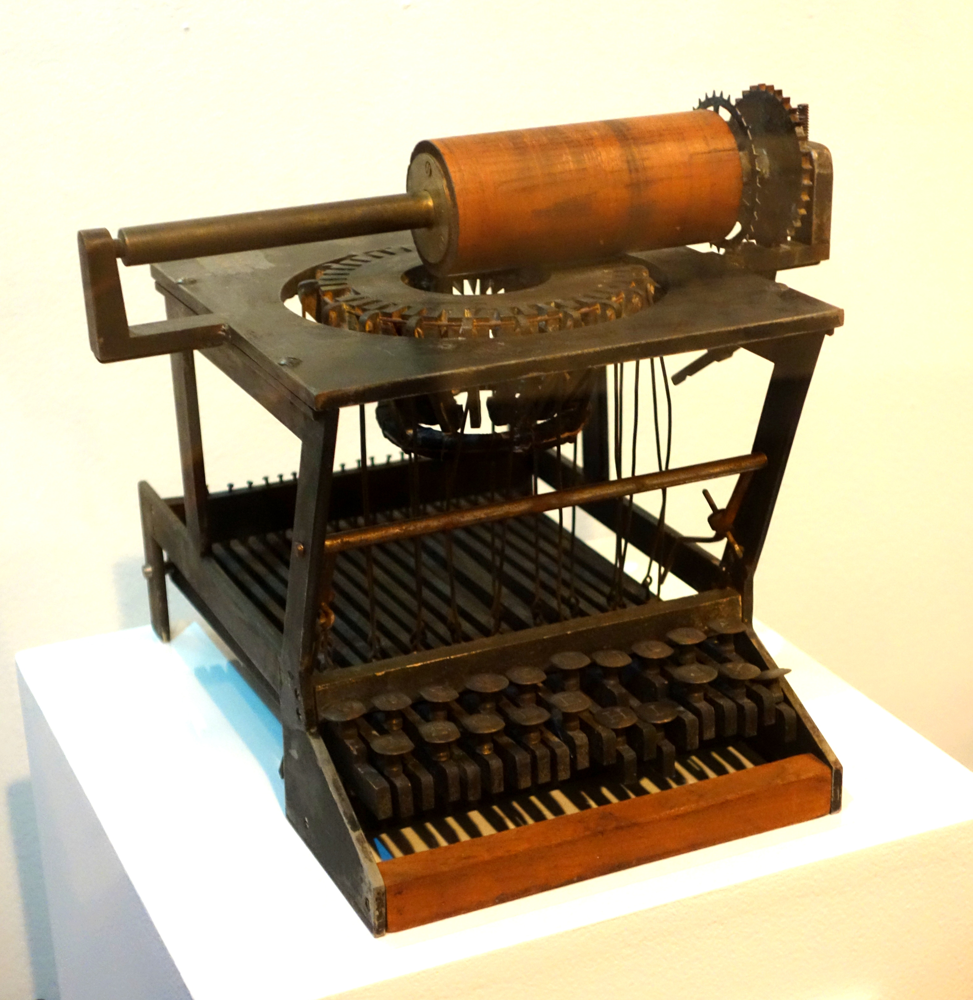

.. note::

    They quickly ditched the piano keys, and in this prototype you can see
    how the machine worked. Pressing a key simply pull a wire, that pulls in
    a small hammer that will hit the paper against a wooden roller and
    impress a letter on the paper. Because these hammers are arranged in a
    circle, if you press two keys at the same time, they can become
    entangled.

----

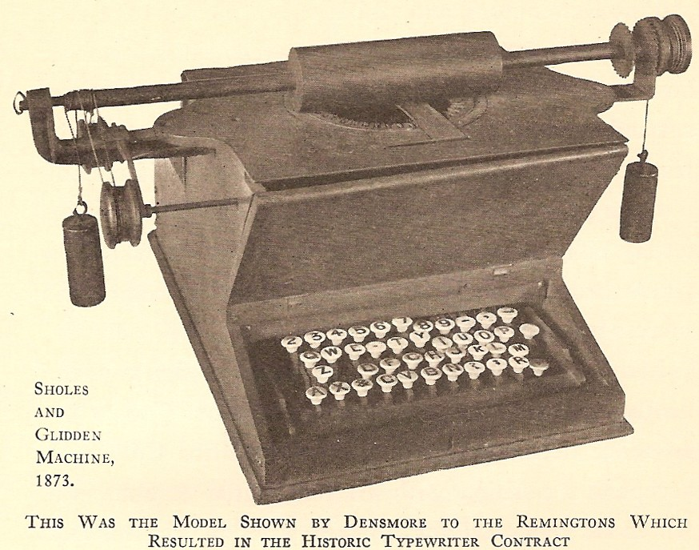

.. note::

    To make it harder for the keys to get stuck, keys that are often used
    together in the English language was placed opposite each other in the
    ring of hammers. The end result was this rather weird layout.

    Although several people was involved in the development of this type
    writer, it's named after only two of them, and generally called a
    Sholes and Glidden or a Remington typewriter, after the company who
    licensed the patent and manufactured them.

----

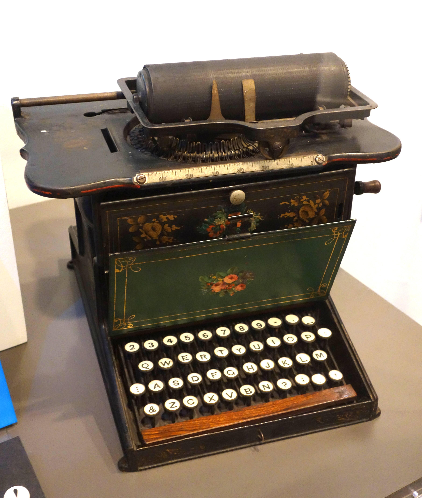

.. note::

    At least remington realized that having a dash in the middle of all the
    letters was strange, and here you can also see another invention; the
    space bar.

    The M is not in the place it is today but other than that this layout
    remained the same for a long time. Using a capital I for the number
    one and a capital O for zero was common on cheaper type writers well
    up to the 50's and 60's.

    This layout was patented, so other keyboard manufacturers had to
    use their own layouts, as well as their own mechanisms. But the
    Remington was so popular that the QWERTY layout simply became
    standard.

----

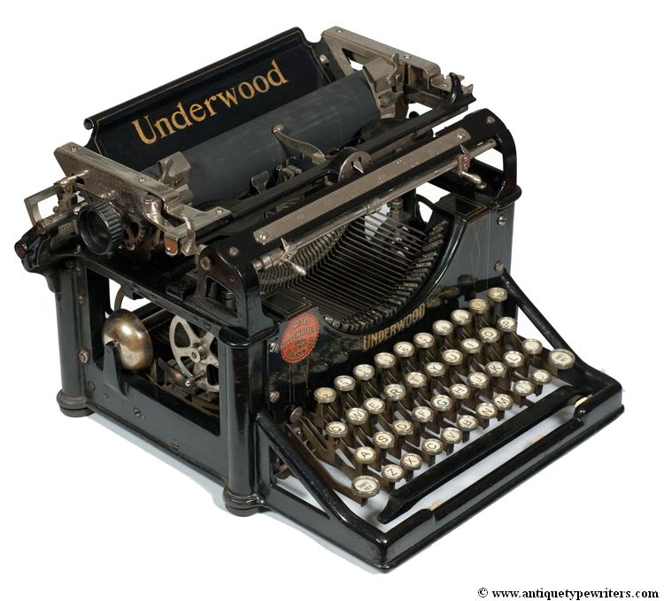

.. note::

    The shift-key is invented in 1878, and front-striking machines come in
    the 1893 and in 1896 the Underwood No 1, pictured here was produced.
    It has, as you can see, a QWERTY keyboard, a shift-key, front-striking,
    so you can see what you type, and a small bell that goes "ding" when you
    get close to the end of the line.

    Typewriter design basically copied the Underwood up to 1961, when IBM
    introduced the IBM Selectric.

----

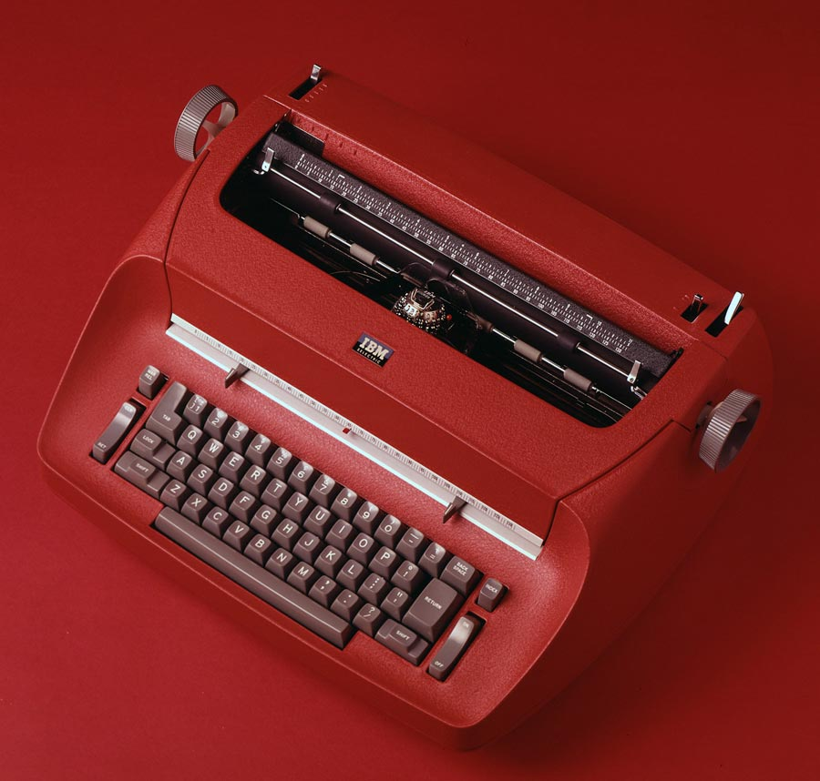

.. note::

    It replaced the basket of hammers with a ball, and and finally solved the
    problem of keys tangling each other.

    But by then, there was another business machine that IBM was starting to
    make money from.

----

.. image:: images/IBM2741.jpg
    :width: 70%

.. note::

    Computers needed input and output, and in the 60's this was punch cards
    and printers. But that wasn't very practical, and soon this was replaced
    with terminals. This is an IBM 2741 from 1965. You are forgiven if you
    think it looks like a Selectric.

----

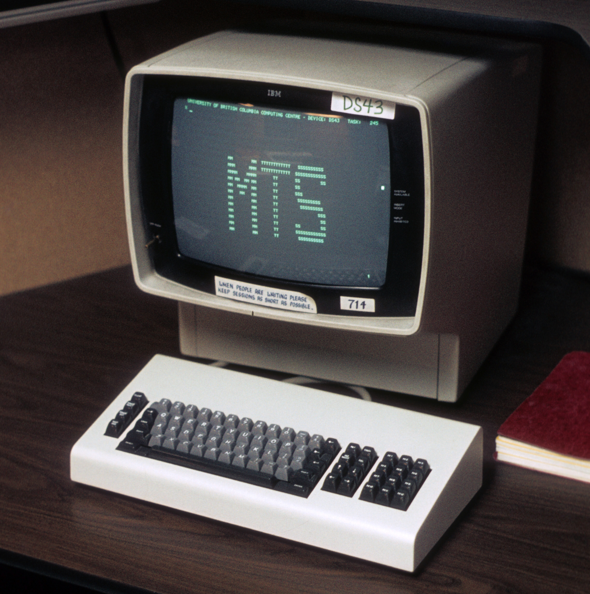

.. note::

    Of course, paper terminals were loud and unpractical, so this was
    replaced with screens.

    This is the IBM 3270 terminal from 1972. The chunky keyboard is more or
    less a selectric keyboard, but with a set of arrow keys and twelve
    function keys to the right.

    No, that is NOT a numerical key pad, it's 12 function keys. If you look
    at your keyboard, how many function keys does it have? Yup. This terminal
    is the reason for that.

----

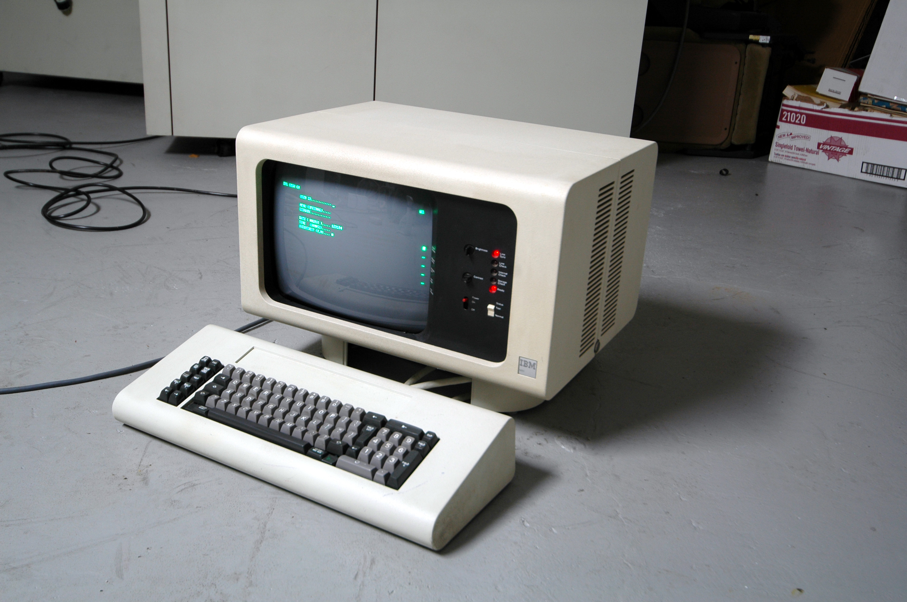

.. note::

    During the 70's terminals was used more and more by office workers. One
    of the things done a lot in these offices was data entry. Typing in loads
    and loads of numbers.

    For it's System/34 mini computer IBM designed a terminal directly designed
    for that environment, the 5250. And here you see a numeric keyboard!

    It lost the function key, but later versions compensated by having 24.

----

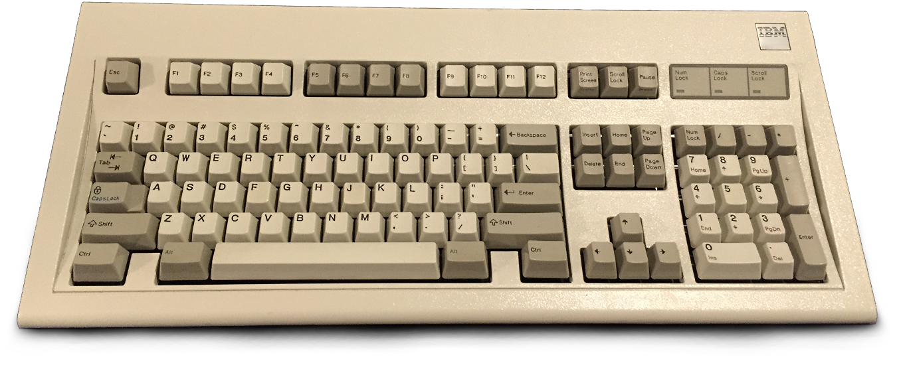

.. note::

    And if you wonder why this history contains only IBM keyboards, it's
    because of course the computers we all use today are descendants of the
    IBM PC. And although the original IBM PC keyboard had a very different
    layout than todays PC keyboards, with for example ten function keys to
    the left of the main keyboard, by 1984 IBM designed the Model M keyboard
    shown here.

    And some of the design features comes directly from IBM's desire to unify
    it's systems and also from the realization that people would want to use
    the PC's as terminal emulators to connect to the economy system on the
    mainframes, while still running Lotus 1-2-3 and Wordperfect on the PC.

    So it gained buttons like "Scroll Lock" and "Sys Request", and gained
    two extra function keys. The only changes to this layout since has been
    Microsoft adding command-keys, inspired by Apple, and various manufacturers
    adding multimedia keys.

    There is one series of non-IBM keyboard worth mentioning though, because
    those are the keyboards used when developing Emacs.

----

The Lisp Keyboards
==================

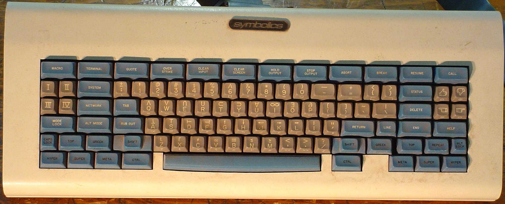

.. note::

    At MIT's artificial intelligence labs they developed computers that would
    run Lisp natively, because they thought that this would somehow enable
    them to do artificial intelligence. The keyboards used for these machines
    had multiple modifier keys, so not only shift and control, but also
    super, hyper and meta!

    This keyboard is the most famous of the keyboards, known as the Space
    Cadet-keyboard, for obvious reasons.

    No other machines had these modifiers, which means Emacs uses Escape as a
    replacement for the meta-key. And these keyboards are also the reason
    many Unix variations call the Alt key "Meta" and the Command-key "Super".

----

How U type?
===========

.. note::

    There are basically two modes of typing:

    * The first school of typing is called Home row touch typing

    * There is no second school

----

Home row touch typing
=====================

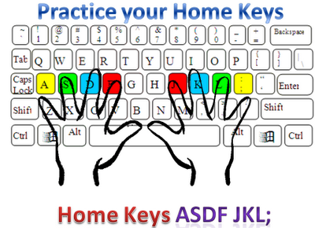

.. note::

    How many use touch typing here?

    Look at this picture.
    Where is this guys arms?
    Does he hold it straight out?
    Are his arms attached to the centre of his chest?

----

Home row touch typing
=====================

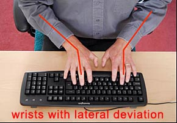

.. note::

    Rather, you end up sitting like this. And that's bad for your wrists.

----

Home row touch typing
=====================

.. image:: images/Truly_Ergonomic_Mechanical_Keyboard-207.jpg

.. note::

    If you are a touch typist, you might want to think about something like this instead.

----

Whoah!
======

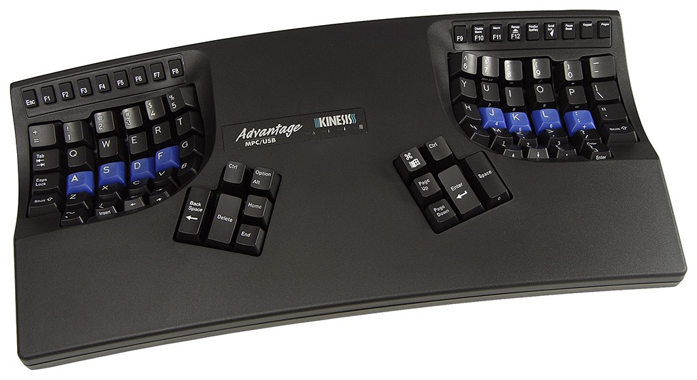

.. note::

    You may if you go to many Python sprints see people who actually will drag keyboards like this around the world.
    They tend to be quite fanatical about them.
    They are probably awesome.

----

No school typing
================

.. note::

    But for the rest of us, keyboards that are split in half are annoying.

----

Numerical Keypad
================

.. note::

    Do you use the numerical keyboard?
    A lot of people don't use it very often.
    It's there because IBM who created the standard keyboard created it for it's
    main frame terminals, and those using it typed in a lot of numbers.

----

No Numerical Keypad!
====================

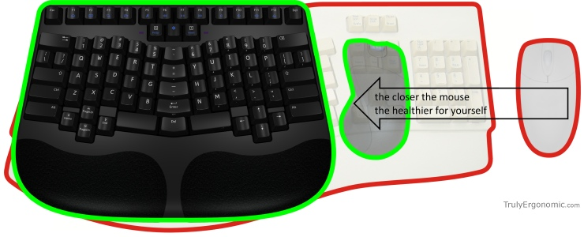

.. note::

    In fact, it forces you to hold your arm to far to the right when mousing.
    And this can lead to shoulder pain.

    But you probably don't use it that much. And then it's just in the way.
    But go to the shop and the keyboards without a numerical keypad are
    often minikeyboards, with tiny keys. You don't want that, believe me!

----

Tenkeyless
==========

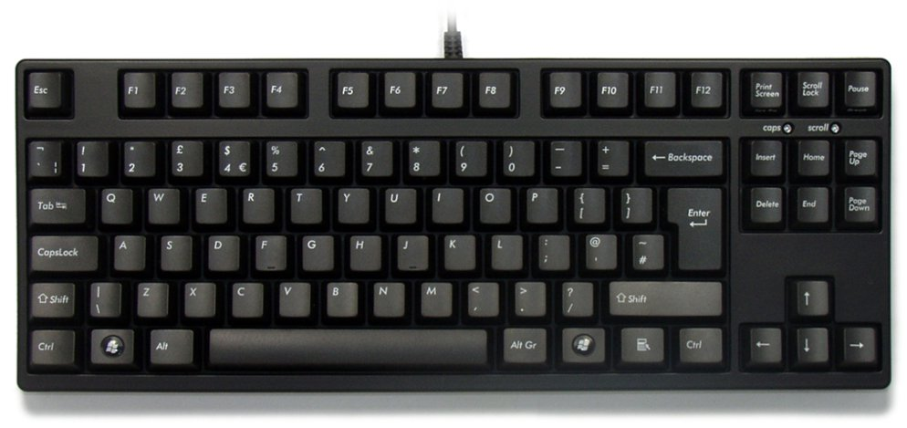

.. note::

    The common name for a full size keyboard that does not have a numerical
    keypad is "tenkeyless". If you don't use the numerical keyboard a lot,
    that's what you want.

----

ISO or ANSI?
============

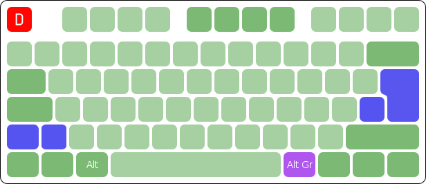

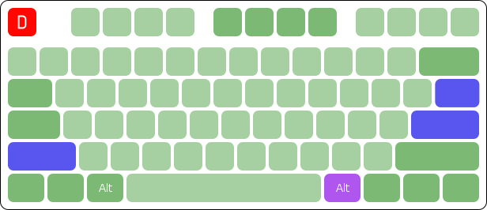

.. note::

    Also: Buyers beware! There are two mayor physical keyboard layouts, ISO, above, ANSI, below.
    Not only is using the layout you are not used to very annoying because you end up pressing a key instead of enter,
    but ANSI is missing a key!

    That key happens to be the key where larger and smaller are on the Swedish keyboard.
    Not having those makes web development hard.

    Polish has standard layouts for both, so you can use whatever, the ANSI layout is the most popular here.
    You on the other hand have two layouts, one official and one that everyone uses.

----

Dvorak?
=======

----

That keyboardin' feeling
========================

.. note::

    And what kind of keys should you use? There's loads and loads! Andthey
    differ in their mechanical design, how much noise they make, how much
    tactile feedback they give you, and how long the key will travel when you
    push it, etc.

    And cheap keyboards here can give you serious pain. That happened to me!

----

Deskthority
===========

http://deskthority.net/wiki/

.. note::

    And here I can only recommend you to read and read and read on Deskthority's big wiki,
    which has crazy amounts of information on keyboards and keyboard switches.

    The most popular switches amongst people who actually look at their keyboard are
    the so called "Cherry MX" series.

----

Tenkeyless Cherry MX Brown with dampener rings
==============================================

.. image:: images/Mx_brown_illustration.gif

.. note::

    After much research I bought a tenkeyless keyboard that uses Cherry MX Brown switches
    and had dampener rings. This both lowers the noise of the keys, and shortens the travel.
    It was a success, I'm very happy with it.

----

That's all folks!
=================

