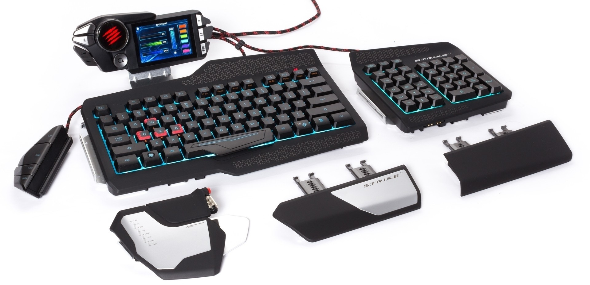
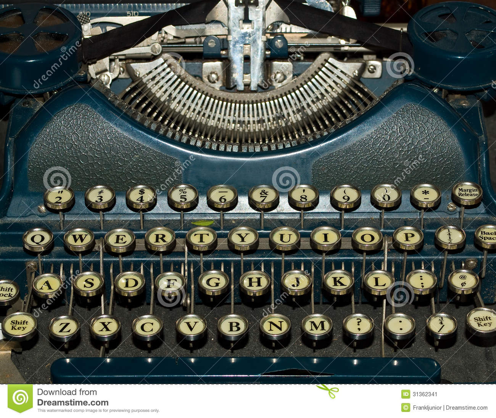

:css: css/slides.css

----

Your keyboard
=============

.. note::

    Have you thought about your keyboard?
    How did you choose it?

----

.. note::

    Because it had cool blue leds?
    It's made by a company that has a Z in the name?

    But the keyboard is the Analog to Digital interface that you use the most.
    It's what makes your physical movements into code.

----

.. note::

    But the keyboard was created for mechanical typewriters.
    And that's what it looks like it does, with staggered keys in straight rows.

----

How U type?
===========

.. note::

    There are basically two modes of typing:

    * The first school of typing is called Home row touch typing

    * There is no second school

----

Home row touch typing
=====================

.. image:: images/keyboarding.png

.. note::

    How many use touch typing here?

    Look at this picture.
    Where is this guys arms?
    Does he hold it straight out?
    Are his arms attached to the centre of his chest?

----

Home row touch typing
=====================

.. image:: images/wrist_bad2_sm.jpg

.. note::

    Rather, you end up sitting like this. And that's bad for your wrists.

----

Home row touch typing
=====================

.. image:: images/Truly_Ergonomic_Mechanical_Keyboard-207.jpg

.. note::

    If you are a touch typist, you might want to think about something like this instead.

----

Whoah!
======

.. image:: images/advantageusb.jpg

.. note::

    You may if you go to many Python sprints see people who actually will drag keyboards like this around the world.
    They tend to be quite fanatical about them.
    They are probably awesome.

----

No school typing
================

.. note::

    But for the rest of us, keyboards that are split in half are annoying.

----

ISO or ANSI?
============

.. image:: images/616px-ISO_layout_basic.svg.png

.. image:: images/616px-ANSI_layout_basic.svg.png

.. note::

    Also: Buyers beware! There are two mayor physical keyboard layouts, ISO, above, ANSI, below.
    Not only is using the layout you are not used to very annoying because you end up pressing a key instead of enter,
    but ANSI is missing a key!

    That key happens to be the key where larger and smaller are on the Swedish keyboard.
    Not having those makes web development hard.

    Polish has standard layouts for both, so you can use whatever, the ANSI layout is the most popular here.
    You on the other hand have two layouts, one official and one that everyone uses.

----

Numerical Keypad
================

.. note::

    Do you use the numerical keyboard?
    A lot of people don't use it very often.
    It's there because IBM who created the standard keyboard created it for it's
    main frame terminals, and those using it typed in a lot of numbers.

----

No Numerical Keypad!
====================

.. image:: images/15007-ergonomic_keyboard_comparison.jpg

.. note::

    In fact, it forces you to hold your arm to far to the right when mousing.
    And this can lead to shoulder pain.

    But you probably don't use it that much. And then it's just in the way.
    But go to the shop and the keyboards without a numerical keypad are
    often minikeyboards, with tiny keys. You don't want that, believe me!

----

Tenkeyless
==========

.. image:: images/filco_tenkeyless_brown_uk_large.jpg

.. note::

    The common name for a full size keyboard that does not have a numerical
    keypad is "tenkeyless". If you don't use the numerical keyboard a lot,
    that's what you want.

----

That keyboardin' feeling
========================

.. note::

    And what kind of keys should you use? There's loads and loads! Andthey
    differ in their mechanical design, how much noise they make, how much
    tactile feedback they give you, and how long the key will travel when you
    push it, etc.

    And cheap keyboards here can give you serious pain. That happened to me!

----

Deskthority
===========

http://deskthority.net/wiki/

.. note::

    And here I can only recommend you to read and read and read on Deskthority's big wiki,
    which has crazy amounts of information on keyboards and keyboard switches.

    The most popular switches amongst people who actually look at their keyboard are
    the so called "Cherry MX" series.

----

Tenkeyless Cherry MX Brown with dampener rings
==============================================

.. image:: images/Mx_brown_illustration.gif

.. note::

    After much research I bought a tenkeyless keyboard that uses Cherry MX Brown switches
    and had dampener rings. This both lowers the noise of the keys, and shortens the travel.
    It was a success, I'm very happy with it.

----

That's all folks!
=================

